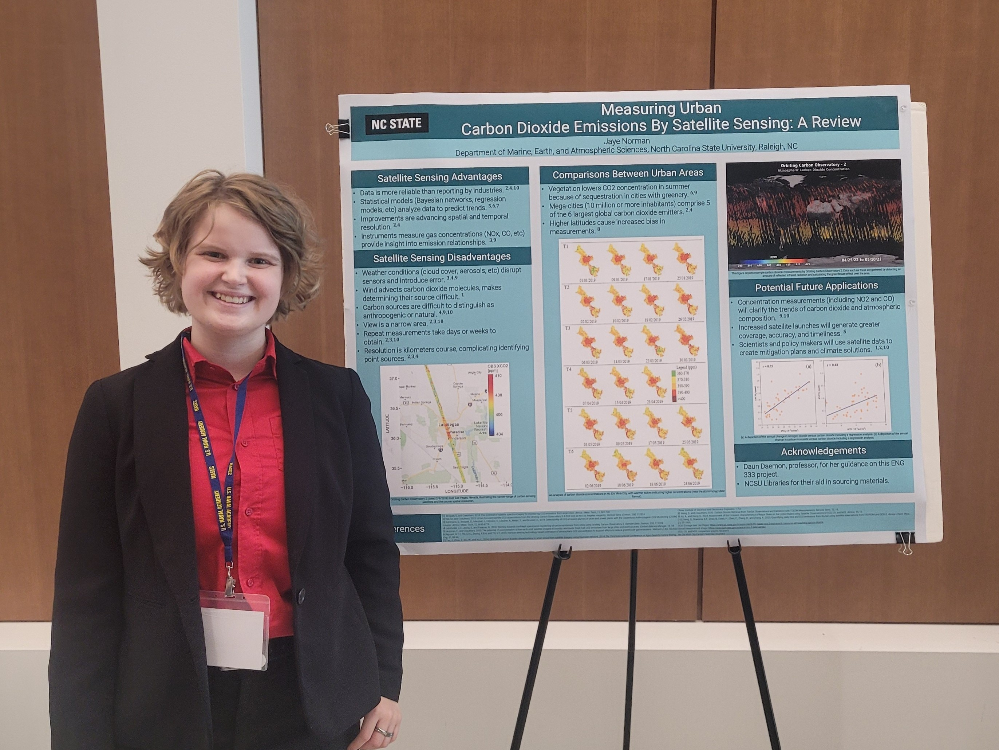

Projects and Presentations
==========================

----------------------------------------------------------------
13th Naval Academy Science and Engineering Conference - Nov 2024
----------------------------------------------------------------
"Measuring Urban Carbon Dioxide Emissions By Satellite Sensing: A Review"
~~~~~~~~~~~~~~~~~~~~~~~~~~~~~~~~~~~~~~~~~~~~~~~~~~~~~~~~~~~~~~~~~~~~~~~~~
Jaye Norman, Department of Marine, Earth, and Atmospheric Science, North Carolina State
University

.. figure:: ../photos/NormanJaye_NASECPoster.png
    :width: 333
    :height: 262.5
    :align: left
    :alt: Photo of poster presented at NASEC conference
    

    

--------------------------------------------------------------
2025 NSF NCAR, UCAR, UCP, and CIRES Summer Student Conference
--------------------------------------------------------------
"Performative Benchmarking of Unidata MetPy in a CI/CD Workflow"
~~~~~~~~~~~~~~~~~~~~~~~~~~~~~~~~~~~~~~~~~~~~~~~~~~~~~~~~~~~~~~~~~~~~~~~~~
Jaye Norman¹\ :sup:`,`\ ², Linfeng Li ¹, Sean Arms ¹, Drew Camron ¹, Ryan May ¹ :
¹ University Corporation for Atmospheric Research (UCAR), NSF Unidata Program Center, Boulder, USA
² North Carolina State University, Raleigh, NC

.. image:: ../photos/NormanJaye_UnidataPoster.png
    :width: 333
    :height: 262.5
    :align: left
    :alt: Photo of poster presented at NCAR Conference
    
.. image:: ../photos/NormanJaye_UnidataPhoto.jpg
    :width: 333
    :height: 262.5
    :align: right
    :alt: Photo of Jaye in front of poster at NCAR conference
